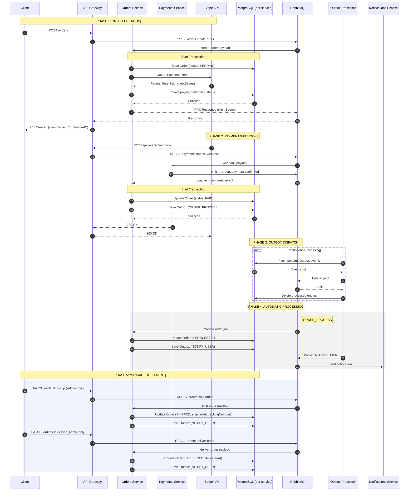

# Dispatch


---

## Overview

Dispatch is an order management API built with NestJS microservices. It takes the patterns from a [previous monolith version](https://github.com/brunoflsantos/dispatch-api) — outbox, distributed locking, idempotency, async flows — and works through the extra problems that come with splitting them across services: typed inter-service contracts, distributed tracing across RPC hops, and keeping each service's database genuinely isolated.

---

## Why I built this

The monolith version pushed async processing and distributed locking about as far as they can go in a single process. The next set of problems is different:

- How do you type inter-service communication so a payload mismatch fails at compile time, not at 3am?
- How do you trace a request that hops through three services before something breaks?
- How do you maintain outbox guarantees when the writer and the consumer live in different processes?

I wanted to solve these with real infrastructure — RabbitMQ for message passing, isolated PostgreSQL databases per service, Loki for log aggregation — rather than shortcuts that paper over the actual problems.

---

## Quick start

**Prerequisites**

- Docker & Docker Compose
- Git

**1.** Clone the repository:

```bash
git clone https://github.com/brunoflsantos/dispatch-api-microservices
cd dispatch-api-microservices
```

**2.** Start the infrastructure:

```bash
npm run docker:infra
```

This brings up PostgreSQL, Redis, RabbitMQ, Loki, Grafana, and Stripe Mock as Docker containers.

**3.** Start all services with hot-reload:

```bash
npm start
```

`start-local.sh` copies each service's `.env.example.local` to `.env.local` on first run, then starts all six services concurrently with debuggers attached.

> To run a single service: `npm run nest:start:<service>` — services: `api-gateway`, `catalog`, `identity`, `orders`, `notifications`, `payments`

**4.** Access:

- API: http://localhost:3000
- Swagger docs: http://localhost:3000/api/docs
- Grafana: http://localhost:3001

When `SEED_TEST_DATA` is `true`, the app creates a mock admin user on startup if one doesn't already exist:

- Name: João Silva
- Email: joao.silva@email.com
- Password: password123
- Role: admin

Development only — not created in production.

---

## Architecture highlights

- **Typed RPC transport**  
  Every inter-service call has a corresponding `*RpcInput` class in `libs/common/modules/transport/dto/`. The class carries the message pattern string as a static property and types both the payload and the response. A mismatch between what the gateway sends and what the target service expects won't compile.

- **RabbitMQ for all inter-service communication**  
  Synchronous calls use `ClientProxy.send()` + `@MessagePattern()` over dedicated RPC queues. Events use `ClientProxy.emit()` + `@EventPattern()` on a shared bus. No direct HTTP between services.

- **Isolated databases per service**  
  Each service has its own PostgreSQL database and TypeORM config. Orders can't accidentally join against the catalog schema. The isolation is real, not a naming convention.

- **Outbox pattern across service boundaries**  
  Orders and payments write events to a local outbox table in the same transaction as the state change. A scheduled processor dispatches them to RabbitMQ afterward. The event can't be lost to a crash between "write the order" and "publish to the bus."

- **Distributed locking with Redlock**  
  Stock reservation in the catalog service runs under a Redlock lock. Concurrent requests for the last item don't race each other to zero.

- **Idempotent mutations**  
  Mutation endpoints accept an `idempotency-key` header. The `IdempotencyService` stores the response in Redis and returns it on duplicate requests.

- **Correlation IDs across RPC hops**  
  Every request gets a correlation ID at the gateway. RPC calls carry it forward via message metadata. Every log line across all services includes it, so you can filter by a single ID in Loki and reconstruct the full request path end to end.

- **JWT auth with token revocation**  
  Access tokens are validated against a Redis blacklist on every request. Logout and token refresh invalidate immediately — the token can't be reused even before it expires.

---

## Services

| Service           | Port     | Responsibility                                                                                                                                                       |
| ----------------- | -------- | -------------------------------------------------------------------------------------------------------------------------------------------------------------------- |
| **api-gateway**   | 3000     | The only public HTTP surface. Authenticates requests, applies rate limiting and idempotency, forwards to internal services via RabbitMQ RPC. Swagger at `/api/docs`. |
| **catalog**       | internal | Products, inventory, stock reservation/confirmation/rollback.                                                                                                        |
| **identity**      | internal | Users, JWT issuance (access + refresh tokens), authentication.                                                                                                       |
| **orders**        | internal | Order lifecycle and state machine (PENDING → PAID → PROCESSED → SHIPPED → DELIVERED → CANCELED/REFUNDED).                                                            |
| **payments**      | internal | Stripe integration, webhook handling.                                                                                                                                |
| **notifications** | internal | Event-driven; listens for order and payment events to send user notifications.                                                                                       |

---

## Order processing flow

1. Client creates an order — api-gateway forwards via RabbitMQ RPC to orders service — Stripe PaymentIntent created, order sits at PENDING
2. Stripe fires a webhook to the payments service when payment settles
3. Payments service emits an event; orders service updates the order to PAID and writes ORDER_PROCESS to the outbox
4. Outbox processor picks up the event and dispatches to RabbitMQ
5. ORDER_PROCESS consumer runs: PAID → PROCESSED, notifications event added to outbox
6. Admin ships the order: `PATCH /orders/:id/ship` → PROCESSED → SHIPPED (accepts optional `trackingNumber` and `carrier`)
7. Admin confirms delivery: `PATCH /orders/:id/deliver` → SHIPPED → DELIVERED
8. Admin cancels pre-shipment: `PATCH /orders/:id/cancel` — ORDER_CANCEL queued, stock restored
9. Admin triggers a refund: `PATCH /orders/:id/refund` — ORDER_REFUND queued, Stripe refund issued
10. On payment failure: ORDER_CANCEL queued automatically — same cancel and restore flow applies

The sequence diagram:



---

## Observability and monitoring

- Structured logging with Pino (JSON)
- Correlation IDs propagated through all RPC hops via message metadata
- Log aggregation via Promtail + Loki
- Visualization with Grafana

All six services write logs to Loki. A correlation ID that starts at the gateway gets forwarded through every RPC call, so filtering by that ID in Grafana shows the complete trace — including failures in services that never returned a response to the caller.

---

## Testing strategy

Unit tests cover service logic in isolation. Integration and E2E tests spin up real PostgreSQL and Redis containers via Testcontainers. No mocked databases.

There's also a k6 load test that hammers concurrent order flows to verify the distributed lock holds under pressure and jobs don't get processed twice when retries fire.

---

## Stripe testing

`STRIPE_EXEC_MODE` controls what the payments service connects to:

- `local`: points to `stripe-mock` at `localhost:12111`. Use when running services outside Docker.
- `docker`: points to `stripe-mock:12111`. Use when the full stack runs inside Docker Compose.
- `live`: talks to Stripe's test environment. Requires your own test key in `.env`.

Integration and E2E tests mock `PaymentGatewaysService`, so they don't depend on Stripe at all. If you want to test real Stripe behavior, switch to `live`.

---

## Features

- Six isolated microservices, each with its own database
- Typed inter-service contracts via RpcInput classes
- Async order processing with outbox pattern
- Idempotency for mutations across service boundaries
- Distributed locking for inventory operations
- JWT auth with immediate token revocation
- Correlation IDs propagated across all RPC hops
- Centralized log aggregation with Loki and Grafana
- Rate limiting and security headers at the gateway

---

## Engineering trade-offs

| Decision                                  | Reason                                                                                                                                                                                                                                            |
| ----------------------------------------- | ------------------------------------------------------------------------------------------------------------------------------------------------------------------------------------------------------------------------------------------------- |
| Separate database per service             | Shared-database microservices aren't really microservices — they just add network latency to a monolith. Each service owns its schema, and any cross-service data need goes through RPC.                                                          |
| RabbitMQ over Kafka                       | Kafka is the right tool if you need ordered, partitioned streams across independent consumer groups at scale. RabbitMQ with acknowledgements covers the actual requirements — reliable RPC and event dispatch — without the operational overhead. |
| Typed RPC inputs over raw pattern strings | Pattern strings like `catalog.find-all-products` are easy to mistype and hard to track down when they drift. Putting them in a class alongside the payload type means the compiler catches a rename that doesn't propagate everywhere.            |
| RPC and event bus on the same broker      | RabbitMQ handles synchronous RPC (reply queues per call) and fire-and-forget events on the same connection. Running a separate broker for events would add infrastructure that solves nothing at this scale.                                      |
| Outbox per service, not a shared outbox   | Each service writes to its own outbox table in its own database. Orders doesn't need a connection to a central event store, and the service boundary stays clean.                                                                                 |

---

## Production considerations

The outbox gives at-least-once delivery. Events are written to each service's local database in the same transaction as the state change. A crash after "update order status" but before "publish to RabbitMQ" doesn't lose the event — the outbox entry survives, and the processor picks it up on the next poll. Duplicate dispatch is caught by idempotency checks at the consumer.

RabbitMQ acknowledgements are explicit. Messages aren't removed from the queue until the consumer acks. A service restart mid-processing requeues the message rather than dropping it.

Distributed locking covers stock reservation, so concurrent webhook deliveries for the same order don't cause split-brain state. The lock covers the full transaction.

---

## What's worth looking at

The transport layer at `libs/common/modules/transport/dto/` is the part that makes inter-service calls less fragile. Each `*RpcInput` class carries the pattern string as a static property and types both the request payload and the expected response. Sending a call from the gateway looks like:

```typescript
const input = new PublicCreateOrderRpcInput({ body, user });
this.ordersClient.send(PublicCreateOrderRpcInput.pattern, input.payload);
```

Adding a new RPC endpoint means adding one class. Changing a payload shape shows you every callsite that needs updating. The consumer on the other end receives a typed object and doesn't have to trust that the sender got the structure right.

The outbox processor at `libs/common/modules/outbox/` uses a recursive `setImmediate` loop to drain event batches without blocking the event loop. Under load it batches aggressively while still yielding between iterations, so a spike in pending events doesn't starve incoming requests.

---

## Final thoughts

This project is about working through what actually changes when you split a backend across services. Some things get harder: tracing, typed contracts, making isolation real. Some things stay the same: the outbox, Redlock, idempotency. And some things that look like they should get harder — testing — don't, because Testcontainers makes real-infrastructure tests straightforward even across multiple services.

The problems here are real problems. This is just a controlled environment to solve them.
